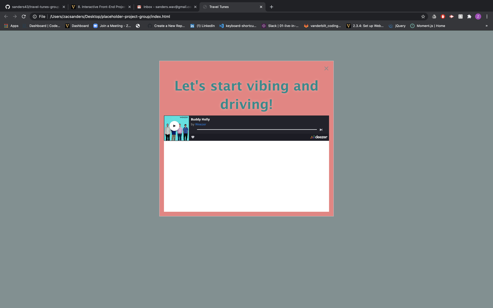

# travel-tunes-group
## Purpose
As a web developer 
I want to create a dynamic web app that allows for user input
So that my users listen to music while/after planning a roadtrip.

## Built with
* HTML
* CSS
* Javascript
* Foundation
* Jquery

## Future Changes
I would like to implement the Spotify API after becoming more proficeint with node.js as well as be able to generate a playlist for the exact length of the roadtrip the user is taking.

## Website
https://sanders43.github.io/travel-tunes-group/

## Screenshot

## Contribution
Developed by Zachary Sanders, Matt Verdillo, Lashell Cole